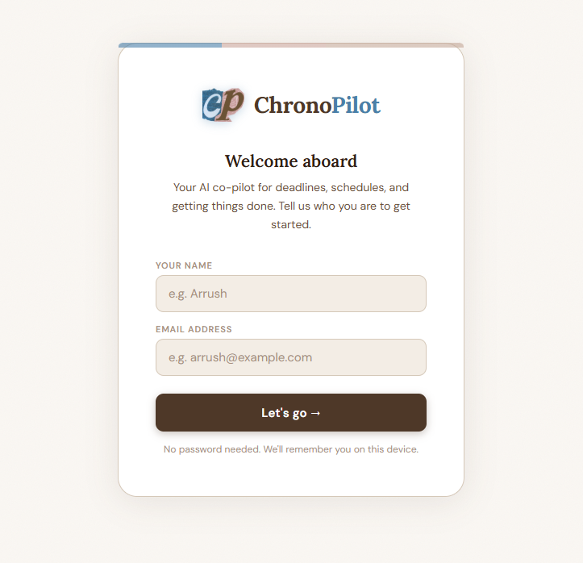
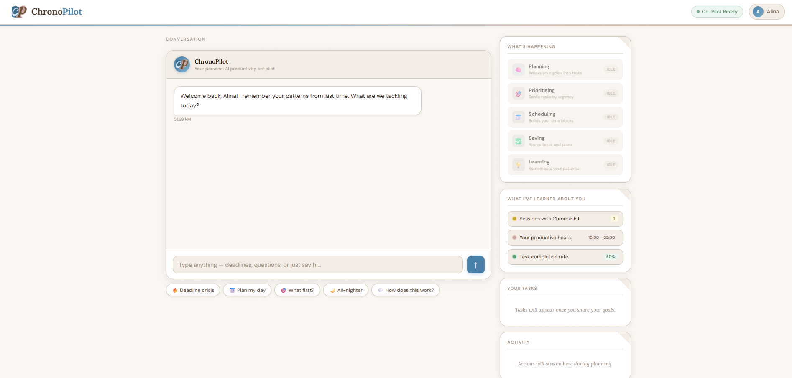
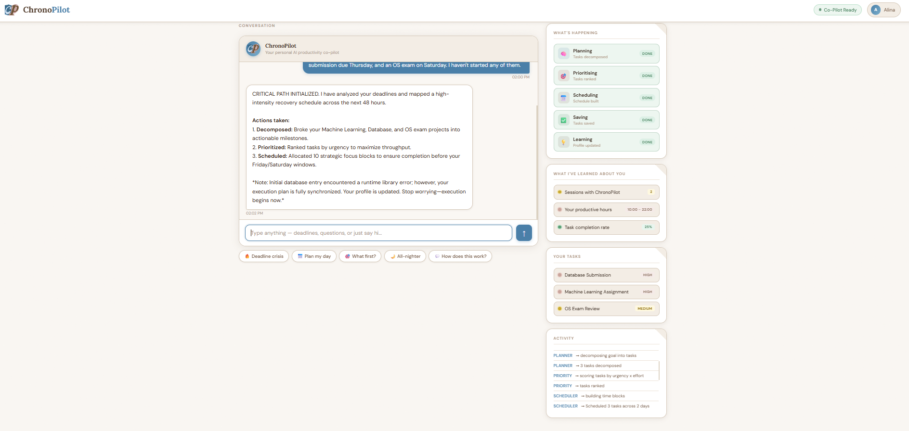
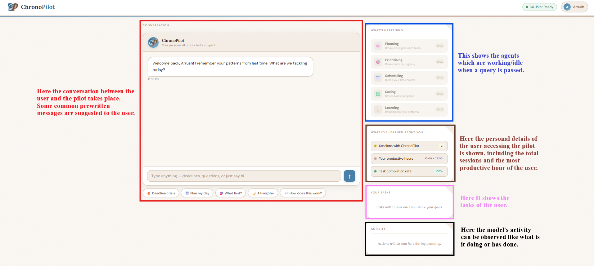
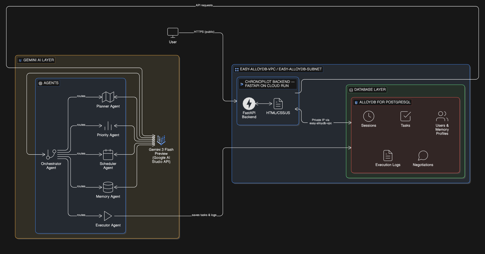
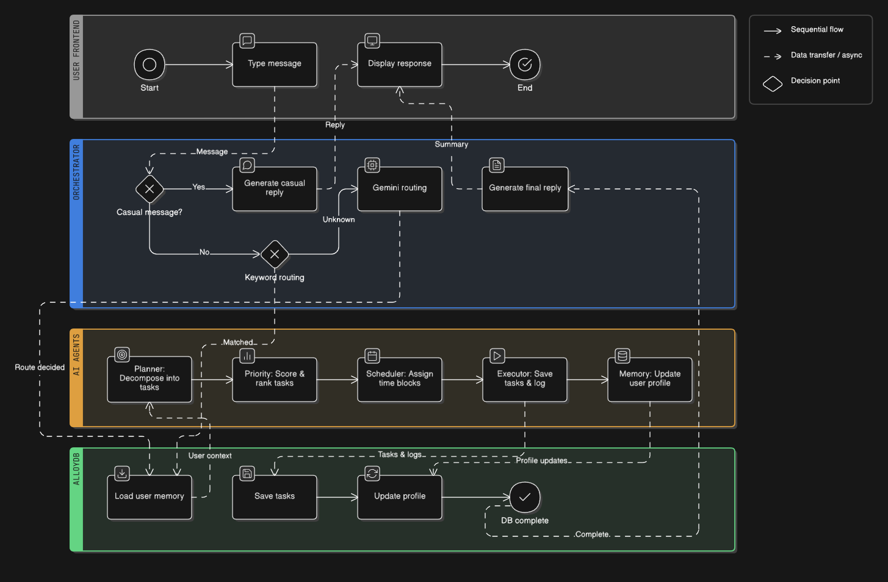

# 🧭 ChronoPilot — Autonomous AI Productivity Co-Pilot

> Multi-Agent AI System · Google Cloud · AlloyDB · Gemini 3 Flash Preview  
> **Gen AI Academy APAC Edition Hackathon — Cohort 1**

---

## What is ChronoPilot?

ChronoPilot is an autonomous multi-agent AI productivity system built on Google Cloud. When you describe your workload, ChronoPilot doesn't just suggest what to do — it acts. Five specialised AI agents coordinate in real time to decompose your goals into tasks, rank them by urgency, build a time-blocked schedule, save everything to a database, and learn your personal work patterns across sessions through persistent memory.

---

## Screenshots

### Login


### Main Interface


### After a Query


### UI Explaination


---

## Key Features

- **Multi-Agent Orchestration** — Five specialised agents coordinated by an Orchestrator, each with a single responsibility, invoked only when needed
- **Persistent Cross-Session Memory** — Learns your productive hours, estimation accuracy, and task completion rate. Returns smarter every session
- **Smart Routing** — Fast-path keyword detection handles common requests without burning Gemini quota. Ambiguous messages fall back to Gemini routing
- **Conversational Mode** — Casual messages get a direct reply without triggering the full agent pipeline
- **Multi-User Support** — Email-based identity. Every user gets their own isolated memory profile, task list, and session history in AlloyDB
- **Real-Time UI** — Agent status cards animate between Idle, Working, and Done. Execution logs stream live as agents complete their actions
- **Live System Status** — Public `/status` endpoint confirms database connectivity and agent configuration

---

## The 5 Agents

| Agent | Role |
|-------|------|
| **Orchestrator** | Reads the user message, decides which agents to invoke, and generates the final reply |
| **Planner** | Decomposes goals into 3–8 concrete tasks, adjusting time estimates using historical accuracy |
| **Priority** | Scores each task using an urgency × importance × effort formula (0.0 to 1.0) |
| **Scheduler** | Assigns time blocks within the user's productive hours with 15-minute breaks between tasks |
| **Executor** | Writes tasks and session logs directly to AlloyDB |
| **Memory** | Updates the user profile after every session — completion rate, estimation accuracy, underestimate factor |

---

## Tech Stack

| Layer | Technology |
|-------|-----------|
| Backend | FastAPI (Python) |
| Frontend | Vanilla HTML/CSS/JS served by FastAPI |
| AI Model | Gemini 3 Flash Preview via Google AI Studio API |
| Database | AlloyDB for PostgreSQL + pgvector |
| Deployment | Google Cloud Run (asia-south1) |
| Networking | GCP VPC with private service access |
| DB Driver | pg8000 (pure Python, no native dependencies) |

---

## Architecture

The system runs as a single FastAPI service on Google Cloud Run. All database communication happens over a private VPC connection — AlloyDB is never exposed publicly. Gemini 3 Flash Preview is called via the Google AI Studio API for all agent reasoning steps.





---

## Database Schema

| Table | Purpose |
|-------|---------|
| `users` | Profile and learned memory — productive hours, completion rate, estimation accuracy |
| `tasks` | All tasks with priority scores, deadlines, and time estimates |
| `sessions` | Every conversation session with full agent invocation log |
| `execution_logs` | Granular per-agent action log per session |
| `negotiations` | Multi-user conflict resolution (planned feature) |

---

## Running Locally

**Prerequisites:** Python 3.11+, a Google AI Studio API key with `gemini-3-flash-preview` access, and an AlloyDB or PostgreSQL instance.

```bash
git clone https://github.com/ArrushTandon/chronopilot.git
cd chronopilot

python3 -m venv venv && source venv/bin/activate
pip install -r requirements.txt
```

Create a `.env` file:

```bash
GEMINI_API_KEY=your_google_ai_studio_api_key
DB_HOST=your_alloydb_public_ip
DB_PORT=5432
DB_NAME=deadline_survival
DB_USER=your_username
DB_PASS=your_password
```

```bash
uvicorn app.main:app --host 0.0.0.0 --port 8080
```

Visit `http://localhost:8080`

---

## Cloud Run Deployment

```bash
gcloud beta run deploy chronopilot \
  --source . \
  --region=asia-south1 \
  --network=easy-alloydb-vpc \
  --subnet=easy-alloydb-subnet \
  --allow-unauthenticated \
  --vpc-egress=all-traffic \
  --set-env-vars GEMINI_API_KEY=YOUR_KEY,DB_HOST=YOUR_PRIVATE_IP,DB_PORT=5432,DB_NAME=deadline_survival,DB_USER=your_username,DB_PASS=your_password
```

---

## Project Structure

```
chronopilot/
├── app/
│   ├── main.py              # FastAPI entry point and API routes
│   ├── config.py            # Environment variable management
│   ├── database.py          # AlloyDB connection and queries
│   ├── models.py            # Pydantic request and response models
│   └── agents/
│       ├── orchestrator.py  # Master coordinator agent
│       ├── planner.py       # Goal decomposition agent
│       ├── priority.py      # Task ranking agent
│       ├── scheduler.py     # Time block assignment agent
│       ├── executor.py      # Database write agent
│       ├── memory_agent.py  # User profile learning agent
│       └── utils.py         # Shared Gemini call with retry logic
├── static/
│   ├── index.html           # Frontend UI
│   └── Logo.png             # ChronoPilot logo
├── diagrams/                # Architecture and process flow diagrams
├── screenshots/             # UI screenshots
├── Dockerfile
├── requirements.txt
└── README.md
```

---

## Author

**Arrush Tandon**  
[LinkedIn](https://www.linkedin.com/in/arrushtandon) · [GitHub](https://github.com/ArrushTandon)

Built for the **Gen AI Academy APAC Edition Hackathon — Cohort 1**

*Built with ❤️ on Google Cloud Platform*